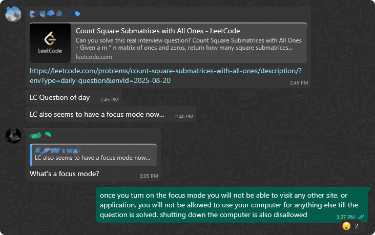

# UltraFocusLeetCode

It all started with the following conversation in an unnamed group chat:

the rest is history

## How it works

- When the focus mode starts, the app enumerates all open windows and tries to find one with "LeetCode" in the title.
- Once found, it brings the window to the foreground and makes it full screen via <kbd>F11</kbd>
- It then registers a mouse and keyboard hook. All non-alphanumeric key combinations are blocked, and any mouse events to other windows are also blocked.
